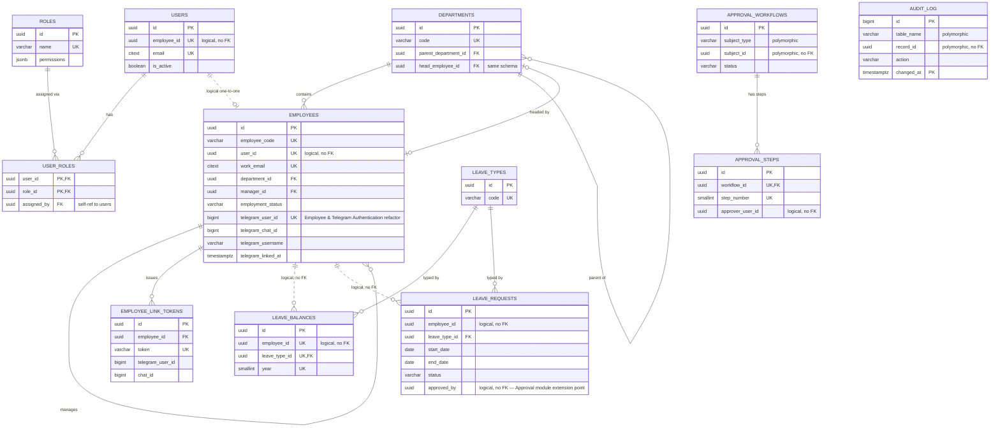

# United HRMS — PostgreSQL Database Design (Phase 1)

Scope: Employee, Department, Role, Telegram Account, Leave Balance, Approval Workflow, Audit Log.
No Django models, no API code — schema design only, per `HRMS_Architecture.md` and `HRMS_Folder_Structure.md`.

---

## 0. Scope Interpretation and Decisions Carried Forward Unchanged

Two things are worth stating before the schema itself, so the reasoning is auditable rather than implicit.

**"Role" is modeled as the identity module's RBAC role** (Employee, Manager, HR Admin, Payroll Admin, Recruiter — the set already named in `HRMS_Architecture.md` §9), not a job title. This reads as the more likely intent because it's grouped with Telegram Account under what the architecture doc already assigned to `apps/identity/`, and because JWT auth (already decided) needs *something* to put in its claims. If "Role" was actually meant as job title/position, that's a small additive table later (`employees.job_titles`, referenced from `employees.employees`) — it doesn't disturb anything below, so nothing here is at risk if that assumption is wrong.

**A `users` table is included even though it wasn't named in the module list.** This is not scope creep — it's a structural prerequisite the list already implies. "Role" is meaningless without something a role is assigned *to*, and "Telegram Account" is meaningless without something it's linked *to*. `HRMS_Architecture.md`'s own `apps/identity/domain/entities.py` already named `User` as an entity. So `identity.users` is included as the load-bearing table those two already-approved concepts sit on top of, not a new module being smuggled in.

No other decision from the prior two documents is changed. Schema-per-module, UUID primary keys, no cross-module foreign keys (cross-module references are plain columns resolved in application code), soft-delete-via-status rather than hard delete, and audit trail as an explicit design concern all carry forward exactly as decided. Where this document adds a specific implementation detail the prior documents left open (e.g., which UUID version, how audit actually gets persisted), it's called out inline as an addition, the same way `module_registry.py` was in the previous phase — not a reversal of anything.

---

## 1. ER Diagram

Solid lines are real, DB-enforced foreign keys (same schema). Dashed lines are **logical references only** — a UUID column with no `REFERENCES` constraint, matching the "no cross-module foreign keys" rule from `HRMS_Architecture.md` §5. This distinction is the single most important thing to read correctly in this diagram: a dashed line crossing a schema boundary is deliberate, not a missing constraint.

Note that `AUDIT_LOG` has no drawn relationships at all — that's intentional, not an omission. Its `table_name`/`record_id` pair can point at *any* row in *any* schema, present or future, which is precisely what makes it able to audit modules that don't exist yet (§9). A polymorphic reference that draws a line to every table it could ever point to isn't a diagram, it's noise.

---

## 2. Database Entities and Purpose

**`identity.users`** — the authenticatable account, exclusively for HR staff/administrators/managers accessing the web application. Deliberately separate from `employees.employees`: not every login belongs to an HR-tracked employee (a break-glass admin account, for instance), and not every employee has (or needs) login access at all — a field worker reached only via Telegram never gets a `users` row, full stop (Employee & Telegram Authentication refactor; see `employees.employees.telegram_user_id`). The one-to-one link is optional on both sides for exactly this reason.

**`identity.roles`** — the fixed, small set of system roles used for authorization (RBAC), matching the roles already named in the architecture doc.

**`identity.user_roles`** — the join between users and roles; a user can hold more than one role (e.g., someone is both a People Manager and a Payroll Admin), which is why this is modeled many-to-many rather than a single `role_id` column on `users`.

**`identity.telegram_accounts` / `identity.telegram_link_tokens` — REMOVED.** Employee & Telegram Authentication refactor: Telegram linking was never really an identity concern — an employee using Telegram is never issued a `users` row at all, so there was nothing here for a Telegram link to legitimately attach to. Both tables moved to `employees.employees.telegram_*` / `employees.link_tokens` (§3.2), keyed by `employee_id`. The Gateway still holds no persistent per-employee credential of any kind (see `TELEGRAM_GATEWAY.md` §4) — it authenticates itself to the backend with one static shared secret, not a stored token.

**`employees.departments`** — the org unit hierarchy. Self-referential for parent/child (division → department → team), and holds an optional head/owner reference back to an employee.

**`employees.employees`** — the core HR profile: identity (name, contact), employment facts (status, type, join/termination dates), and structural placement (department, manager). Deliberately excludes anything belonging to a not-yet-built module — no salary field, no document links, no performance rating — those all attach *to* this table from their own future schemas (§9), never live inside it.

**`leave.leave_types`** — a small lookup table (Annual, Sick, Unpaid, ...) rather than a hardcoded set of strings scattered across the codebase, so HR can add a new leave type as a data change, not a deployment.

**`leave.leave_balances`** — the per-employee, per-leave-type, per-year entitlement/usage record. This is balance *state*, not leave *requests* — request history and workflow live in `leave.leave_requests` (below).

**`leave.leave_requests`** — Phase 8. One row per leave application: the requested date range, the derived `total_days`, `status` (`draft`/`pending`/`approved`/`rejected`/`cancelled`), and four columns (`approved_by`, `decided_at`, `decision_comments`, plus `cancelled_at`/`cancellation_reason`) that exist specifically as the not-yet-built Approval module's integration point — see §3.3 and `HRMS_Architecture.md`'s Phase 8 notes for why these are added now rather than via a future migration. Deliberately does **not** reference `leave_balances` by FK: `used_days` on the balance row is only updated when a request is approved (`LeaveRequestService.approve()`), not at application time, so the two tables stay independently correct rather than needing a join to reconcile.

**`approvals.approval_workflows`** — one row per thing currently going through approval, identified polymorphically by `subject_type` + `subject_id` (e.g., `'leave_request'` + a UUID) rather than by a foreign key to any specific business table. This is the concrete implementation of the "generic approval engine, no knowledge of leave or payroll as concepts" decision already made in `HRMS_Architecture.md` §3.

**`approvals.approval_steps`** — the ordered sequence of individual decisions within a workflow, one row per approver-in-line.

**`audit.audit_log`** — a single, generic, append-only record of who changed what, where, and when, across every schema. This is the concrete database object implementing the audit trail concept the architecture doc described in prose (§5: "state transitions are captured as immutable domain events"); it lives in its own `audit` schema because, like `platform/` in the codebase, auditing is a cross-cutting technical concern owned by no single business module.

---

## 3. Table Structure

Conventions used throughout: primary keys are `UUID DEFAULT uuid_generate_v7()` unless noted otherwise (see §5.1 for why v7, not v4, and why `audit_log` is the one exception). All timestamps are `TIMESTAMPTZ`. All tables except `audit_log` carry `created_at`/`updated_at`; tables holding data mutated by a human action also carry `created_by`/`updated_by` (`UUID`, logical reference to `identity.users.id`, nullable to allow system/Celery-originated writes).

### 3.1 Schema `identity`

#### `identity.users`

| Column | Type | Nullable | Default | Key / Constraint |
|---|---|---|---|---|
| id | UUID | NO | `uuid_generate_v7()` | PK |
| employee_id | UUID | YES | NULL | UNIQUE (logical ref → `employees.employees.id`, no FK — cross-schema) |
| email | CITEXT | NO | — | UNIQUE |
| password_hash | VARCHAR(255) | NO | — | |
| is_active | BOOLEAN | NO | `true` | |
| is_system_account | BOOLEAN | NO | `false` | true for non-employee admin/service accounts |
| last_login_at | TIMESTAMPTZ | YES | NULL | |
| created_at | TIMESTAMPTZ | NO | `now()` | |
| updated_at | TIMESTAMPTZ | NO | `now()` | |

#### `identity.roles`

| Column | Type | Nullable | Default | Key / Constraint |
|---|---|---|---|---|
| id | UUID | NO | `uuid_generate_v7()` | PK |
| name | VARCHAR(50) | NO | — | UNIQUE |
| description | TEXT | YES | NULL | |
| permissions | JSONB | NO | `'[]'` | array of permission codes — see §6.3 for why this is JSONB, not a normalized table |
| is_system_role | BOOLEAN | NO | `false` | true for the five seeded roles; blocks deletion, not modification |
| created_at | TIMESTAMPTZ | NO | `now()` | |
| updated_at | TIMESTAMPTZ | NO | `now()` | |

#### `identity.user_roles`

| Column | Type | Nullable | Default | Key / Constraint |
|---|---|---|---|---|
| user_id | UUID | NO | — | PK (composite), FK → `users.id` ON DELETE CASCADE |
| role_id | UUID | NO | — | PK (composite), FK → `roles.id` ON DELETE RESTRICT |
| assigned_by | UUID | YES | NULL | FK → `users.id` ON DELETE SET NULL (self-referential, same table) |
| assigned_at | TIMESTAMPTZ | NO | `now()` | |

#### `identity.telegram_accounts` / `identity.telegram_link_tokens` — REMOVED

**Employee & Telegram Authentication refactor.** Both tables (and their rows) are dropped — see `apps/identity/migrations/0004_drop_telegram_tables.py`. Telegram linking was never really an identity concern; it moved to `employees.employees`'s own `telegram_*` columns and the new `employees.link_tokens` table (§3.2 below), keyed by `employee_id` instead of `user_id`. No employee using Telegram is ever issued a `users` row.

### 3.2 Schema `employees`

#### `employees.departments`

| Column | Type | Nullable | Default | Key / Constraint |
|---|---|---|---|---|
| id | UUID | NO | `uuid_generate_v7()` | PK |
| name | VARCHAR(150) | NO | — | |
| code | VARCHAR(20) | NO | — | UNIQUE |
| parent_department_id | UUID | YES | NULL | FK → `departments.id` ON DELETE RESTRICT (self-ref) |
| head_employee_id | UUID | YES | NULL | FK → `employees.id` ON DELETE SET NULL — added via `ALTER TABLE` after `employees` exists, see note below |
| is_active | BOOLEAN | NO | `true` | |
| created_at | TIMESTAMPTZ | NO | `now()` | |
| updated_at | TIMESTAMPTZ | NO | `now()` | |
| created_by | UUID | YES | NULL | logical ref → `identity.users.id` |
| updated_by | UUID | YES | NULL | logical ref → `identity.users.id` |

*Circular reference note:* `departments.head_employee_id` → `employees.id` and `employees.department_id` → `departments.id` are mutually dependent. Both are real FKs (same schema), resolved the standard way: create both tables with `department_id` in place first, then `ALTER TABLE departments ADD CONSTRAINT fk_head_employee ...` once `employees` exists. This is a well-known, ordinary pattern for org-chart-shaped data, not a design flaw.

#### `employees.employees`

| Column | Type | Nullable | Default | Key / Constraint |
|---|---|---|---|---|
| id | UUID | NO | `uuid_generate_v7()` | PK |
| employee_code | VARCHAR(20) | NO | — | UNIQUE, generated from `employees.employee_code_seq` (e.g. `EMP-000042`) |
| user_id | UUID | YES | NULL | UNIQUE (logical ref → `identity.users.id`, no FK — cross-schema) |
| first_name | VARCHAR(100) | NO | — | |
| last_name | VARCHAR(100) | NO | — | |
| work_email | CITEXT | NO | — | UNIQUE |
| personal_email | CITEXT | YES | NULL | |
| phone_number | VARCHAR(20) | YES | NULL | |
| date_of_birth | DATE | YES | NULL | PII — see §8 |
| gender | VARCHAR(30) | YES | NULL | open text by design, see §6.3 |
| date_of_joining | DATE | NO | — | |
| termination_date | DATE | YES | NULL | |
| employment_status | VARCHAR(20) | NO | `'active'` | CHECK IN (`active`,`on_leave`,`suspended`,`terminated`) |
| employment_type | VARCHAR(20) | NO | — | CHECK IN (`full_time`,`part_time`,`contract`,`intern`) |
| department_id | UUID | NO | — | FK → `departments.id` ON DELETE RESTRICT |
| manager_id | UUID | YES | NULL | FK → `employees.id` ON DELETE SET NULL (self-ref) |
| job_title | VARCHAR(150) | NO | — | plain text for now, see §9 |
| telegram_user_id | BIGINT | YES | NULL | UNIQUE — Employee & Telegram Authentication refactor; moved from (removed) `identity.telegram_accounts` |
| telegram_chat_id | BIGINT | YES | NULL | |
| telegram_username | VARCHAR(100) | YES | NULL | |
| telegram_linked_at | TIMESTAMPTZ | YES | NULL | |
| created_at | TIMESTAMPTZ | NO | `now()` | |
| updated_at | TIMESTAMPTZ | NO | `now()` | |
| created_by | UUID | YES | NULL | logical ref → `identity.users.id` |
| updated_by | UUID | YES | NULL | logical ref → `identity.users.id` |

#### `employees.link_tokens`

Employee & Telegram Authentication refactor — moved from (removed) `identity.telegram_link_tokens`, keyed by `employee_id` (a real, same-schema FK) instead of `user_id`. Also carries the Telegram identifiers supplied at "request" time, since there is no separate not-yet-verified account row to read them back from at verify time.

| Column | Type | Nullable | Default | Key / Constraint |
|---|---|---|---|---|
| id | UUID | NO | `uuid_generate_v7()` | PK |
| employee_id | UUID | NO | — | FK → `employees.id` ON DELETE CASCADE |
| token | VARCHAR(64) | NO | — | UNIQUE — SHA-256 hex digest of the OTP, never the raw code |
| telegram_user_id | BIGINT | NO | — | Indexed together with `chat_id` (composite, `employees_link_tok_chat_idx`) — this is the exact shape `get_pending_by_chat` queries by (application/services/employee_telegram_linking_service.py's `verify_link`) |
| chat_id | BIGINT | NO | — | |
| telegram_username | VARCHAR(100) | YES | NULL | |
| expires_at | TIMESTAMPTZ | NO | — | typically `now() + interval '10 minutes'`, set by application |
| used_at | TIMESTAMPTZ | YES | NULL | |
| attempt_count | SMALLINT | NO | `0` | Wrong-OTP guess counter — locked (`too_many_otp_attempts`) at 5 (`MAX_OTP_ATTEMPTS`), added post-milestone-review error-handling hardening pass |
| created_at | TIMESTAMPTZ | NO | `now()` | |

### 3.3 Schema `leave`

#### `leave.leave_types`

| Column | Type | Nullable | Default | Key / Constraint |
|---|---|---|---|---|
| id | UUID | NO | `uuid_generate_v7()` | PK |
| name | VARCHAR(50) | NO | — | UNIQUE |
| code | VARCHAR(20) | NO | — | UNIQUE |
| default_annual_days | NUMERIC(5,2) | NO | `0` | |
| is_paid | BOOLEAN | NO | `true` | |
| requires_approval | BOOLEAN | NO | `true` | |
| is_active | BOOLEAN | NO | `true` | |
| created_at | TIMESTAMPTZ | NO | `now()` | |
| updated_at | TIMESTAMPTZ | NO | `now()` | |

#### `leave.leave_balances`

| Column | Type | Nullable | Default | Key / Constraint |
|---|---|---|---|---|
| id | UUID | NO | `uuid_generate_v7()` | PK |
| employee_id | UUID | NO | — | logical ref → `employees.employees.id`, no FK — cross-schema |
| leave_type_id | UUID | NO | — | FK → `leave_types.id` ON DELETE RESTRICT |
| year | SMALLINT | NO | — | |
| entitled_days | NUMERIC(5,2) | NO | `0` | CHECK >= 0 |
| used_days | NUMERIC(5,2) | NO | `0` | CHECK >= 0 |
| carried_forward_days | NUMERIC(5,2) | NO | `0` | CHECK >= 0 |
| created_at | TIMESTAMPTZ | NO | `now()` | |
| updated_at | TIMESTAMPTZ | NO | `now()` | |

UNIQUE (`employee_id`, `leave_type_id`, `year`).

#### `leave.leave_requests` (Phase 8)

| Column | Type | Nullable | Default | Key / Constraint |
|---|---|---|---|---|
| id | UUID | NO | `uuid_generate_v7()` | PK |
| employee_id | UUID | NO | — | logical ref → `employees.employees.id`, no FK — cross-schema |
| leave_type_id | UUID | NO | — | FK → `leave_types.id` ON DELETE RESTRICT |
| start_date | DATE | NO | — | |
| end_date | DATE | NO | — | CHECK `end_date >= start_date` |
| total_days | NUMERIC(5,2) | NO | — | CHECK > 0 — derived once at creation from `start_date`/`end_date` (inclusive whole-day count), stored rather than recomputed on every read |
| reason | TEXT | YES | NULL | |
| status | VARCHAR(20) | NO | `'pending'` | CHECK IN (`draft`,`pending`,`approved`,`rejected`,`cancelled`) |
| approved_by | UUID | YES | NULL | logical ref → `identity.users.id`, no FK — **Approval module extension point**, unused this phase |
| decided_at | TIMESTAMPTZ | YES | NULL | Approval module extension point |
| decision_comments | TEXT | YES | NULL | Approval module extension point |
| cancelled_at | TIMESTAMPTZ | YES | NULL | |
| cancellation_reason | TEXT | YES | NULL | |
| created_at | TIMESTAMPTZ | NO | `now()` | |
| updated_at | TIMESTAMPTZ | NO | `now()` | |
| created_by | UUID | YES | NULL | logical ref → `identity.users.id` |
| updated_by | UUID | YES | NULL | logical ref → `identity.users.id` |

Indexes: `(employee_id, status)` — the overlap/duplicate/history query shape; `(employee_id, start_date, end_date)` — the date-range overlap query shape (`start_date <= :end AND end_date >= :start`). No index needed on `approved_by`/`decided_at` this phase — nothing queries by them yet, and adding one speculatively ahead of a real query shape would be exactly the kind of premature optimization the architecture doc's indexing philosophy avoids.

### 3.4 Schema `approvals`

#### `approvals.approval_workflows`

| Column | Type | Nullable | Default | Key / Constraint |
|---|---|---|---|---|
| id | UUID | NO | `uuid_generate_v7()` | PK |
| subject_type | VARCHAR(50) | NO | — | e.g. `'leave_request'` — polymorphic discriminator |
| subject_id | UUID | NO | — | polymorphic target, no FK possible (target table varies) |
| status | VARCHAR(20) | NO | `'pending'` | CHECK IN (`pending`,`approved`,`rejected`,`cancelled`) |
| current_step_number | SMALLINT | NO | `1` | |
| initiated_by | UUID | NO | — | logical ref → `identity.users.id` |
| initiated_at | TIMESTAMPTZ | NO | `now()` | |
| completed_at | TIMESTAMPTZ | YES | NULL | |
| created_at | TIMESTAMPTZ | NO | `now()` | |
| updated_at | TIMESTAMPTZ | NO | `now()` | |

Partial UNIQUE index on (`subject_type`, `subject_id`) WHERE `status = 'pending'` — prevents two concurrent, competing approval workflows over the same subject.

#### `approvals.approval_steps`

| Column | Type | Nullable | Default | Key / Constraint |
|---|---|---|---|---|
| id | UUID | NO | `uuid_generate_v7()` | PK |
| workflow_id | UUID | NO | — | FK → `approval_workflows.id` ON DELETE CASCADE |
| step_number | SMALLINT | NO | — | CHECK > 0 |
| approver_user_id | UUID | YES | NULL | logical ref → `identity.users.id`, no FK |
| approver_role_id | UUID | YES | NULL | logical ref → `identity.roles.id`, no FK |
| status | VARCHAR(20) | NO | `'pending'` | CHECK IN (`pending`,`approved`,`rejected`,`skipped`) |
| decided_at | TIMESTAMPTZ | YES | NULL | |
| comments | TEXT | YES | NULL | |
| created_at | TIMESTAMPTZ | NO | `now()` | |

CHECK (`approver_user_id IS NOT NULL OR approver_role_id IS NOT NULL`) — a step must be routable to either a specific person or anyone holding a role. UNIQUE (`workflow_id`, `step_number`).

### 3.5 Schema `audit`

#### `audit.audit_log` (RANGE-partitioned by `changed_at`, monthly)

| Column | Type | Nullable | Default | Key / Constraint |
|---|---|---|---|---|
| id | BIGINT | NO | `GENERATED ALWAYS AS IDENTITY` | PK (composite with `changed_at`, required by Postgres for partitioned tables) |
| changed_at | TIMESTAMPTZ | NO | `now()` | PK (composite), partition key |
| schema_name | VARCHAR(50) | NO | — | |
| table_name | VARCHAR(63) | NO | — | |
| record_id | UUID | NO | — | polymorphic, no FK |
| action | VARCHAR(10) | NO | — | CHECK IN (`INSERT`,`UPDATE`,`DELETE`) |
| changed_by | UUID | YES | NULL | logical ref → `identity.users.id`; NULL = system/Celery |
| changed_by_source | VARCHAR(20) | NO | `'system'` | CHECK IN (`web`,`telegram`,`api`,`system`) |
| old_values | JSONB | YES | NULL | NULL on INSERT |
| new_values | JSONB | YES | NULL | NULL on DELETE |
| changed_fields | TEXT[] | YES | NULL | column names that changed, for fast filtering without JSONB diffing |
| request_id | UUID | YES | NULL | correlates all audit rows from one API call |

Why `id` is `BIGINT` here and `UUID` everywhere else is explained in §5.1 — it's the one deliberate exception in the whole schema, and it's called out rather than silently done differently.

---

## 4. Relationships

**One-to-one:** `identity.users` ↔ `employees.employees` (optional both directions — a user account need not have an employee profile, and an employee need not yet have login access; enforced via the `UNIQUE` constraint on each side's foreign column, not a real FK, since it crosses schemas). An `employees.employees` row also has at most one Telegram link, directly on itself (`UNIQUE` on `employees.telegram_user_id`) — not a separate table, per the Employee & Telegram Authentication refactor.

**One-to-many:** `employees.departments` → `employees.employees` (a department contains many employees). `employees.departments` → `employees.departments` (self-referential parent/child hierarchy). `employees.employees` → `employees.employees` (self-referential manager → direct reports). `leave.leave_types` → `leave.leave_balances` (a leave type has many balance records, one per employee per year). `leave.leave_types` → `leave.leave_requests` (a leave type has many requests). `approvals.approval_workflows` → `approvals.approval_steps` (a workflow has an ordered set of steps). `employees.employees` → `employees.link_tokens` (an employee may have issued several link tokens over time, only one ever redeemable — moved from removed `identity.users` → `identity.telegram_link_tokens`).

**Many-to-many:** `identity.users` ↔ `identity.roles`, through `identity.user_roles` — the only true many-to-many relationship in this phase's scope, reflecting that a person can legitimately hold more than one system role simultaneously.

**Logical (cross-schema, no DB-enforced FK):** `identity.users.employee_id`, `employees.employees.user_id`, `leave.leave_balances.employee_id`, `leave.leave_requests.employee_id`/`approved_by`, `approvals.approval_workflows.subject_id`/`approval_steps.approver_user_id`/`approver_role_id`, every `created_by`/`updated_by` column, and `audit.audit_log.record_id`. All of these are intentionally plain columns, not foreign keys, because they cross the module/schema boundary established in `HRMS_Architecture.md` §5 — referential integrity for these is the responsibility of the application layer (repository/port pattern), not the database.

---

## 5. Index Strategy

### 5.1 Primary indexes, and the UUID version decision

Every table's primary key gets Postgres's automatic B-tree index for free. The one detail the architecture doc left open is *which* UUID generation to use, and it matters more at 50,000+ employees than it looks: random UUIDv4 primary keys insert in random order across a B-tree, which causes page splits and index bloat under sustained write load — a real, measurable cost on high-insert tables like `leave_balances` and especially `audit_log`. The fix, without giving up any of the reasons the architecture doc chose UUIDs in the first place (client-generatable, non-sequential, doesn't leak business volume), is **UUIDv7** — time-ordered UUIDs that insert roughly sequentially (good B-tree locality, like a serial column) while still being globally unique, generatable outside the database, and not exposing row count or creation order to the degree an auto-increment integer would in an API response. This is a refinement of the existing UUID decision, not a reversal of it.

`audit.audit_log` is the deliberate exception: its primary key is `BIGINT GENERATED ALWAYS AS IDENTITY`, not UUID. Two reasons converge here. First, it's by far the highest insert-volume table in the schema (every change to every audited row, across every module, forever), and a plain sequential bigint is the cheapest possible primary key to index at that volume — cheaper even than UUIDv7. Second, unlike every other table, `audit_log`'s primary key is never returned in a public API response as a resource identifier that could leak business volume — it's an internal log row id, not a "how many leave requests exist" signal. Both reasons that motivated UUIDs elsewhere simply don't apply here, so this is the one place the more efficient native option is used instead.

### 5.2 Foreign key indexes

PostgreSQL does **not** automatically index foreign key columns (only the referenced side gets an index via the primary key). Every FK column in this schema needs an explicit B-tree index, or every join and every `ON DELETE` cascade check degrades to a sequential scan as tables grow. Concretely: `user_roles.role_id`, `link_tokens.employee_id`, `departments.parent_department_id`, `departments.head_employee_id`, `employees.department_id`, `employees.manager_id`, `leave_balances.leave_type_id`, `leave_requests.leave_type_id`, `approval_steps.workflow_id` all get explicit indexes. (`user_roles.user_id` and similar composite-PK leading columns don't need a separate index — the PK's B-tree already serves lookups on the leading column.)

### 5.3 Search optimization indexes

- `employees.work_email`, `employees.employee_code`: already unique-indexed by their constraints, which doubles as the lookup path for "find employee by email/code" — the single most common query shape in an HR system.
- `employees(first_name, last_name)` with the `pg_trgm` extension: a GIN trigram index, to support fuzzy/partial-match employee directory search ("looks like 'Shahid Nazir'") without falling back to `LIKE '%...%'` sequential scans.
- Partial index `employees(department_id) WHERE employment_status = 'active'`: the overwhelming majority of queries filter to active employees only (org charts, directory listings, leave/approval routing) — a partial index keeps this common filter cheap and keeps the index itself small as terminated employees accumulate over years.
- `employees.telegram_user_id`: already unique-indexed, which is also the exact lookup the Gateway performs on every incoming message (resolve Telegram user → Employee record), so this index is on the hottest possible path for that service. Moved from (removed) `identity.telegram_accounts.telegram_user_id` — same reasoning, new home.
- `approvals.approval_workflows(subject_type, subject_id)`: composite index (backing the partial-uniqueness constraint from §3.4) — this is how a business module asks "is there an active approval on my record" without a sequential scan.
- `audit.audit_log(table_name, record_id, changed_at DESC)`: composite index on every partition — the standard "show me the history of this one record" query, ordered for the common "most recent first" access pattern.

### 5.4 Performance considerations at 50,000+ employee scale

The employee-scale tables themselves (`employees`, `departments`, `users`, `roles`) are, in database terms, small — 50,000 rows is trivial for Postgres regardless of indexing choices; query *pattern* (search, filtering, joins) matters far more than raw row count here. The tables that actually need scale planning are the ones that grow with *activity*, not headcount: `leave_balances` (bounded — roughly employees × leave types × years, still low hundreds of thousands after a decade), `approval_workflows`/`approval_steps` (grows with every leave request, review cycle, etc. that needs approval — moderate, monitor over time), and `audit.audit_log`, which is genuinely unbounded and the reason it's partitioned monthly by `changed_at` from day one rather than retrofitted later. Monthly partitioning keeps each partition's index small enough to stay cache-resident, makes old-data archival or drop-per-retention-policy an `O(1)` metadata operation instead of a slow `DELETE`, and lets autovacuum work on manageable chunks instead of one ever-growing table. `leave_balances` and `audit_log`, being the highest-churn tables, also warrant tighter autovacuum thresholds (`autovacuum_vacuum_scale_factor` lowered from the default) so dead tuples from frequent updates don't accumulate between vacuum runs. Connection pooling (PgBouncer) was already specified in the architecture doc's scaling strategy and isn't repeated here, but it's the other half of "50,000 employees performing fine" — the schema being well-indexed doesn't help if connection overhead is the bottleneck instead.

---

## 6. Constraints

### 6.1 Unique constraints

`users.email`, `employees.employee_code`, `employees.work_email`, `employees.telegram_user_id`, `departments.code`, `roles.name`, `leave_types.name`/`code`, `link_tokens.token`, composite `(employee_id, leave_type_id, year)` on `leave_balances`, composite `(workflow_id, step_number)` on `approval_steps`, and the composite primary keys on `user_roles` themselves acting as the uniqueness guarantee against duplicate role assignment.

### 6.2 Check constraints — data integrity only, not business rules

Every CHECK constraint below enforces structural/data sanity — the kind of invariant that should never be violated regardless of which client or code path wrote the row. It deliberately does **not** encode business rules like "an employee can't request more leave than their balance" — per Clean Architecture as already established, that belongs in the domain layer, where it can carry a meaningful error message back through the application layer, not a raw Postgres constraint violation. The line drawn here: a CHECK constraint answers "is this value structurally valid," never "is this action currently allowed."

Concretely: `employees.employment_status IN (...)`, `employees.employment_type IN (...)`, `employees.termination_date IS NULL OR termination_date >= date_of_joining`, `leave_balances.entitled_days >= 0` (and same for `used_days`, `carried_forward_days`), `approval_steps.step_number > 0`, `approval_steps.approver_user_id IS NOT NULL OR approver_role_id IS NOT NULL`, `approval_workflows.status IN (...)`, `audit_log.action IN (...)`.

### 6.3 Other data integrity decisions worth explaining

**Status/type columns use `VARCHAR` + `CHECK IN (...)`, not native Postgres `ENUM` types.** A native enum is marginally more storage-efficient, but adding a new value later is a schema migration with its own quirks (pre-PG12 couldn't even do it inside a transaction), while a CHECK constraint is a one-line `ALTER TABLE ... DROP CONSTRAINT / ADD CONSTRAINT` — and HR systems reliably grow new statuses over time (a new employment type, a new approval outcome). This trades a few bytes per row for meaningfully easier evolution, which is the right trade for a system explicitly required to stay extensible.

**`employees.gender` is open `VARCHAR`, not a constrained enum.** Unlike employment status, this is personal, self-reported data where a fixed small list would either be incomplete or force a bad fit — validated (if at all) as a UI-level suggestion list in the frontend, not a database constraint.

**Email columns use the `citext` extension**, not `VARCHAR` + a `LOWER()` functional index. This makes `WHERE email = 'Shahid@Example.com'` and `WHERE email = 'shahid@example.com'` both correctly hit the same unique row and the same index, matching how email uniqueness actually behaves in practice, without every query in the codebase needing to remember to call `LOWER()` first.

**The single deliberate denormalization: `roles.permissions` as JSONB instead of a normalized `permissions` / `role_permissions` pair.** With a small, slow-changing set of roles (five named in the architecture doc), a fully normalized permission model buys query flexibility this system doesn't currently need, at the cost of two extra tables and two extra joins on every authorization check. The JSONB array is still indexable (GIN, if a lookup pattern later needs it) and still queryable with Postgres's native JSONB operators — this isn't "give up and dump JSON," it's choosing the appropriately-sized structure for ~5-10 roles, with a clean upgrade path (a normalized `permissions`/`role_permissions` pair, additive, no change to `roles` or `user_roles`) if permission-level reporting or dozens of discrete permissions later make that worthwhile. This is the one place in the schema where "normalized structure" was weighed against "avoid unnecessary complexity" and the latter won — called out explicitly rather than left for a reviewer to wonder about.

---

## 7. Audit Design

**Who changed it:** `audit_log.changed_by` (the acting user, resolved through JWT identity regardless of whether the request came via web or Telegram) plus `changed_by_source` (`web`/`telegram`/`api`/`system`) — so "an HR admin changed this via Telegram" and "a Celery job changed this automatically" are both distinguishable at a glance, which matters given this system explicitly has two human-facing clients plus scheduled jobs all capable of writing data.

**What changed:** `old_values`/`new_values` as JSONB snapshots, plus `changed_fields` as a plain text array specifically so "did the salary-relevant fields change" (once Payroll exists) can be answered with an array-contains query instead of diffing two JSONB blobs on every read. `table_name`/`schema_name`/`record_id` identify exactly which row, in which module, was affected — generically enough that this table needs zero changes when Attendance, Payroll, or any future module starts writing audit rows into it (§9).

**When it changed:** `changed_at`, which doubles as the partition key (§5.4) — the audit trail's time-ordering and its storage/performance strategy are the same column, deliberately, rather than two separate timestamp concerns.

**How rows get here, architecturally:** consistent with Clean Architecture, no database trigger silently writes to `audit_log` behind the application's back — a trigger-based approach would mean the *interface* of what gets audited lives in the database instead of the codebase, invisible to code review. Instead, the application layer's Unit of Work (`platform/infrastructure/django_unit_of_work.py`, per the folder structure doc) is responsible for emitting an audit row alongside each state-changing use case, as an explicit, reviewable part of that use case's transaction — the database's only job is to store what the application layer decided to record, and to make sure nothing can quietly alter or delete it afterward (§8).

---

## 8. Security Considerations

### 8.1 Sensitive data handling

`employees.date_of_birth`, `personal_email`, and `phone_number` are PII and are flagged as such via `COMMENT ON COLUMN` in the actual migration (a lightweight, queryable way to let automated compliance/data-classification tooling discover sensitive columns without maintaining a separate document that drifts out of sync). None of them are encrypted at the column level in this phase — encryption-at-rest is handled at the volume/disk level per the architecture doc's security strategy, which is proportionate for contact-detail PII. This is deliberately different from the treatment already planned for Payroll's bank account and tax ID fields (§9), which the architecture doc already called out for field-level encryption — compensation and tax data carry materially higher exposure risk than a date of birth or phone number, and the schema should not over-encrypt low-risk fields at the cost of query performance and operational complexity.

`employees.telegram_chat_id` and `telegram_user_id` are treated as sensitive identifiers — they should never appear in a list/export endpoint's default response shape, since they're effectively a direct messaging address for the person. (Moved from removed `identity.telegram_accounts` — same rule, new home.)

### 8.2 Access control considerations

Three least-privilege PostgreSQL roles, distinct from the application-level RBAC in `identity.roles` (these are database login roles, not HR system roles — worth being explicit about the difference since the names are easy to conflate): `hrms_app` (read/write, used by the Django backend's connection pool — the only role with `INSERT`/`UPDATE` on business tables), `hrms_app_readonly` (read-only, for future reporting/BI tooling), and `hrms_migrator` (DDL privileges only, used by CI/CD to run migrations, never held by the running application).

`hrms_app` is explicitly granted only `SELECT, INSERT` on `audit.audit_log` — **no `UPDATE`, no `DELETE`** — enforced at the database privilege level, not just application discipline. This is what makes the audit trail tamper-evident rather than merely tamper-discouraged: even a compromised or buggy application connection physically cannot alter or erase history, because the database user it's running as was never granted the privilege to do so.

Row-Level Security (RLS) is deliberately not applied in this phase — this is a single-tenant system, and RLS's value is clearest in multi-tenant or highly compartmentalized-access scenarios; adding it now would be exactly the kind of unnecessary complexity the requirements ask to avoid. It's a reasonable future addition (e.g., if regional HR teams should only see their own region's employees) and nothing in this schema forecloses it.

---

## 9. Future Extensibility

The test for each future module below is the same: can it be added by creating new tables in a new schema that reference `employees.employees.id` (or another existing table) via a plain logical column, with zero `ALTER TABLE` on any table defined in this document. Every one passes that test, for the same structural reason — the cross-module "no real FK" rule adopted throughout this schema means every existing table is already closed to modification and open to being referenced, which is the Open/Closed Principle applied at the schema level.

| Future module | New schema | References existing tables via | Existing tables touched |
|---|---|---|---|
| Attendance | `attendance` | `employee_id` (logical) → `employees.employees.id` | none |
| Payroll | `payroll` | `employee_id` (logical) → `employees.employees.id`; `leave_balances.id` (logical) if unpaid-leave deductions apply | none |
| Recruitment | `recruitment` | on hire, writes a new row into `employees.employees` through the normal insert path (not a schema change) | none |
| Performance Management | `performance` | `employee_id` (logical); can reuse `approvals.approval_workflows` with `subject_type = 'performance_review'` for review sign-off, no change to that table | none |
| Employee Documents | `documents` | `employee_id` (logical) → `employees.employees.id` | none |
| Training | `training` | `employee_id` (logical); can reuse `approvals` the same way for training-enrollment approval if ever needed | none |
| Asset Assignment | `assets` | `employee_id` (logical) → `employees.employees.id` | none |

Two design choices already made in this document are doing most of the work behind that "none" column, worth naming explicitly: the **polymorphic `subject_type`/`subject_id` shape of `approvals.approval_workflows`** means any future module that needs an approval step (asset request sign-off, training budget approval, performance review finalization) plugs into the existing approval engine by writing rows with a new `subject_type` string — the table itself never changes. And the **generic `schema_name`/`table_name`/`record_id` shape of `audit.audit_log`** means every future table gets audit coverage automatically, the moment its module's Unit of Work starts emitting rows into it — again, zero change to the audit table itself.

The one place a future module *will* eventually want to reference something more specific than "an employee" — Payroll wanting to know an employee's current department for cost-center reporting, for instance — that's resolved the same way cross-module reads are already resolved everywhere else in this architecture: through an application-layer port/adapter calling into the Employees module's public interface, not through a database join. The schema boundary staying closed is what makes that guarantee real rather than aspirational.

---

## Summary

Twelve tables across four business schemas (`identity`, `employees`, `leave`, `approvals`) plus one cross-cutting `audit` schema. One table (`identity.users`) added beyond the named list because two named concepts (`Role`, `Telegram Account`) structurally required it. One deliberate denormalization (`roles.permissions` as JSONB), one deliberate non-UUID primary key (`audit_log`, for volume reasons), and one deliberate use of native Postgres extensions (`citext` for email, `pg_trgm` for search) — each called out with its reasoning rather than left implicit. Every table added here for a future module (§9) attaches to what exists without altering it, which was the hardest constraint in the brief and the one this design was built around first.
